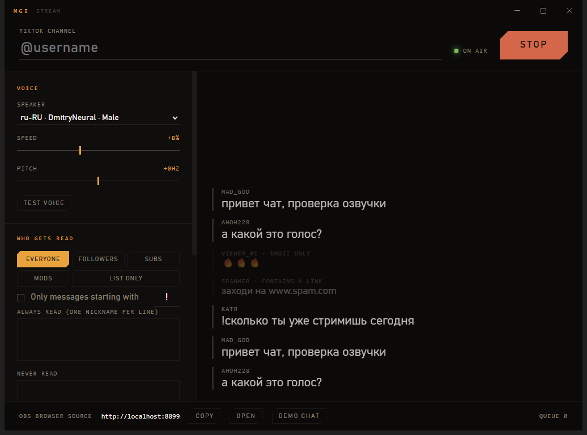

# mgi-stream

Reads your TikTok LIVE chat out loud, into OBS, from your own machine.



Interface in Russian and English, switch in the top right corner.

TikFinity does this as a hosted service you do not control. mgi-stream does the same job as a Windows app that runs on your PC: it joins the live chat, drops what should not be spoken, synthesizes each message with Microsoft Edge neural voices, and plays it through a page you add to OBS as a browser source.

## Install

Grab `mgi-stream-<version>-setup.exe` from [Releases](../../releases) and run it. The portable build needs no installation at all.

The build is not code-signed, so SmartScreen shows a warning the first time: **More info → Run anyway**.

## Use it

1. Type the channel name, for example `@yourname`. This is the account whose live chat gets read.
2. Pick a voice, set speed and pitch, hit **test voice**. Four presets cover the common cases (Russian and English, male and female); the dropdown below them holds every voice Edge offers.
3. Press **go on air**.
4. In OBS add **Source → Browser**, paste the URL from the bottom bar (`http://localhost:8099`), size it 900x600.

Speech now arrives on its own OBS audio track with its own volume slider. Nothing else on your desktop goes into it.

**Demo chat** replays sample messages so you can set the voice up before you ever go live.

### No TikTok login

You never sign in. The app joins the public chat of a live room the same way a viewer's browser does, so all it needs is the channel name. Nothing is posted, nothing is read from your account, and no password or session cookie is stored anywhere.

Two things follow from that. The stream has to be live at the moment you press **go on air**, and you can point the app at somebody else's stream just as easily as your own.

## What gets read

Chat moves faster than anyone can talk, so the useful part of this app is what it refuses to say.

**Audience.** Everyone, followers only, subscribers only, moderators only, or nobody except the names you list. The tier comes from the viewer flags TikTok attaches to each message, not from a guess.

**A prefix.** Turn it on and only messages that start with `!` get read. Any character works. The prefix itself is not spoken.

**Lists.** *Always read* passes a name through no matter which audience tier is set. *Never read* silences a name entirely.

**Noise.** Emoji-only messages, links, and anything shorter than two characters are dropped by default. Long messages are cut instead of read to the end.

Every filtered message still shows up in the app, greyed out with the reason next to the nickname, so nothing disappears silently.

## Why the queue has a limit

Chat produces messages faster than speech plays them back. An unbounded queue puts the voice minutes behind the picture, and it never catches up. The queue caps at a depth you choose and drops the oldest pending message when it overflows, which keeps the audio close to what is happening on screen. The footer shows the current depth and how many were dropped.

## How it works

```
TikTok LIVE ──▶ filter ──▶ queue ──▶ Edge neural TTS ──▶ WebSocket ──▶ OBS browser source
  (webcast)     who/what    capped      mp3 per phrase                   plays in order
```

Everything runs in one Electron process on your machine. The local HTTP server exists only to feed the OBS overlay; it listens on localhost and serves one page.

Synthesis holds its socket open, so a phrase takes roughly 300 to 600 ms after the first one. The overlay keeps its own playback queue and starts the next clip on `ended`, which is what stops two messages from talking over each other.

## Limits

TikTok has no official realtime chat API. This uses [`tiktok-live-connector`](https://github.com/zerodytrash/TikTok-Live-Connector), which speaks the internal Webcast protocol, so a TikTok-side change can break the connection until that library catches up.

Speech comes from the public endpoint behind Edge Read Aloud. It costs nothing and needs no key, but it is an internet round trip per phrase and Microsoft can change it. Russian ships two voices, `ru-RU-DmitryNeural` and `ru-RU-SvetlanaNeural`; other languages have more. Moving to a local engine such as Piper or Silero means replacing `app/core/tts.js` alone, since the rest of the app only handles mp3 buffers.

Chat only. Gifts, follows, likes, alerts, and overlays are out of scope.

## Build from source

```bash
npm install
npm start          # run the app
npm test           # filter rules
npm run dist       # dist/*.exe, installer and portable
```

Settings live in `%APPDATA%/mgi-stream/config.json`.

## License

MIT
